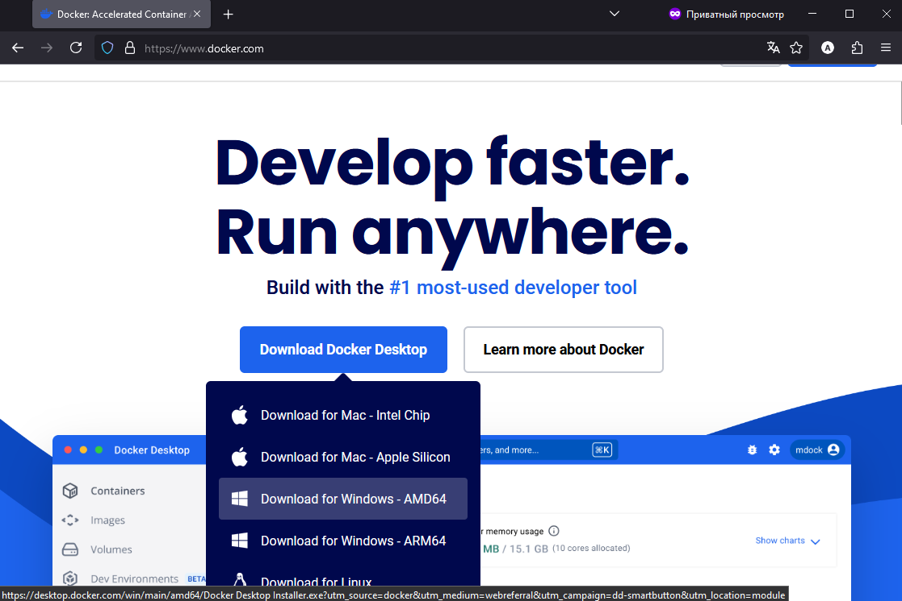

TrackVisor Desktop App  
==========
Electron desktop application for TrackVisor  

Minimum system requirements to build the app
- MacOS: Monterey 12.3.1  
- Windows: 22H2 10.0.19045, 11.0.22621
- Debian: bullseye+kde 11
- Ubuntu: LTS 22.04
- Alt linux: kworkstation 10
- Astra linux: orel 2.12
- CPU: amd64

### For build to work, you need to have following dependencies:
#### MacOS
You need to install xcode from [official website](https://developer.apple.com/xcode/)

#### Linux (apt based)
```bash
apt-get update
apt-get install -y git cmake curl python3 build-essential pkg-config libsecret-1-0 libsecret-1-dev ca-certificates openssh-client dpkg-dev dpkg-sig
```
##### Installl nodejs 14.19.0 (MacOS & Linux)  
Easiest way to do so is by using nvm, here is the [official guide on how to install it](https://github.com/nvm-sh/nvm?tab=readme-ov-file#install--update-script).  

Now we can use it to install nodejs.  
```bash
nvm install 14.19.0
nvm use 14.19.0
```
Install yarn
```bash
npm install -g yarn
```

You can verify the installation like so:
```bash
node -v # v14.19.0
yarn -v # 3.2.1
```

#### Windows
##### Download and install Docker Desktop from the [official site](https://www.docker.com/).



For Docker to work in Windows you may need to enable virtualization in BIOS and [install WSL 2](https://learn.microsoft.com/en-us/windows/wsl/install). The installation process is described in details [in the Docker user manual](https://docs.docker.com/desktop/setup/install/windows-install/).


## Launch development version (Linux & MacOS only)
1. Clone this repository and open it's directory
2. Install dependencies via `yarn`
3. Specify version, for example `v1.0.0"`
```bash
npm config set git-tag-version false
npm version v1.0.0
```
4. Run webpack via `yarn build-development` for development version
5. When build completes, run `yarn dev` to launch client in development mode

## Development mode
Development installation uses different keychain service name and application folder path (with "-develop" suffix).

## Build production version
1. Clone this repository and open its directory
2. (Windows only) run in PowerShell `docker run -it -v ${PWD}:/project electronuserland/builder:14-wine` next commands should be executed inside running container.
3. Install dependencies via `yarn`
4. Specify version, for example `v1.0.0`
```bash
npm config set git-tag-version false
npm version v1.0.0
```
5. Build application in production mode via `yarn build-production`
6. Build executable for your favourite platform (output directory is `/target`).


How to build executable?
  - **macOS:** `yarn package-mac` will produce signed & notarized DMG
  - **Linux:** `yarn package-linux` will produce Tarball, DPKG and AppImage
  - **Windows:** `yarn package-windows` will produce installer and portable executables

Compatibility sheet:
  - **Host with macOS:** can produce builds only for macOS
  - **Host with Linux:** can produce builds for Linux and Windows (using Wine)
  - **Host with Windows:** can produce builds only for Windows
